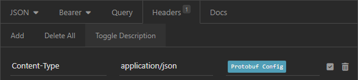

# Insomnia Protobuf
Use protobuffers in your request and response bodies.

## How-to
1) Add the header `x-use-proto` (removed when requests are sent)
2) Set the headers value to the `Protobuf Config` template.
3) Set the request/response `.proto` files and types (one or both)

## Request
Use `JSON` in your body as normal (See [protobufjs](https://www.npmjs.com/package/protobufjs#using-proto-files) for details on the conversion to protobuf).

## Response
Set the content-type in the `Protobuf Config` to match the content-type of the response (Used to identify protobuf responses).

## Example
